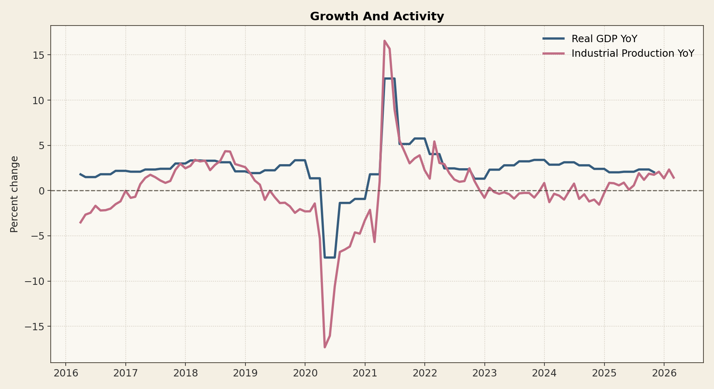
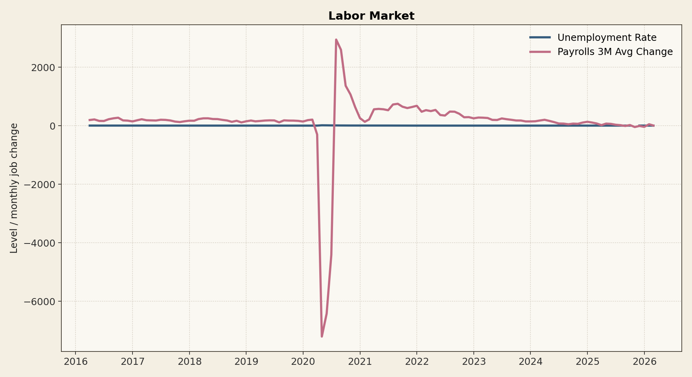
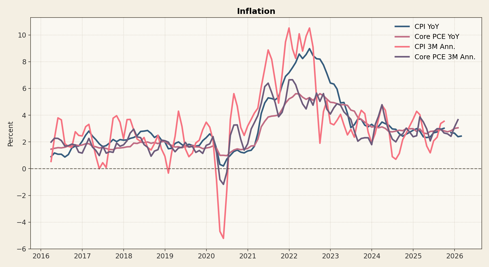
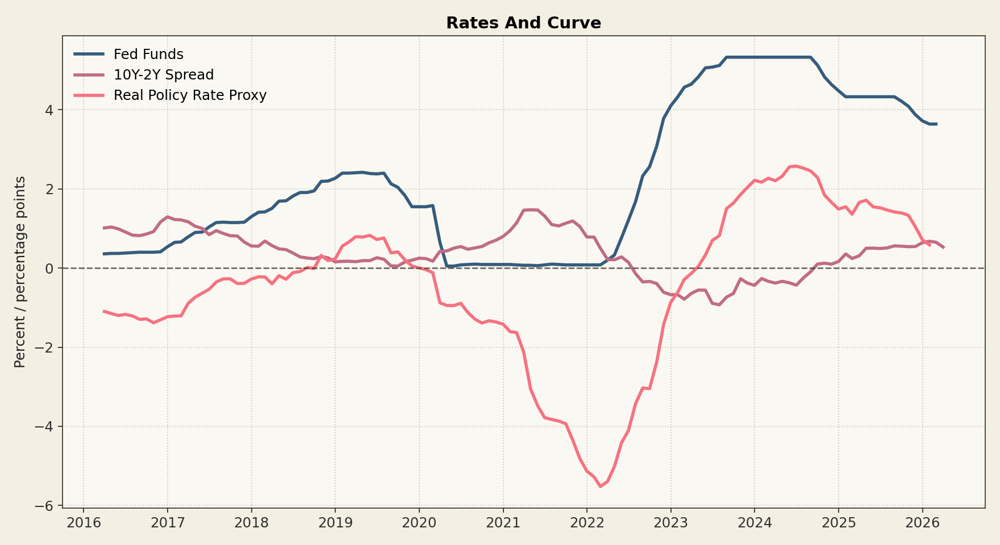
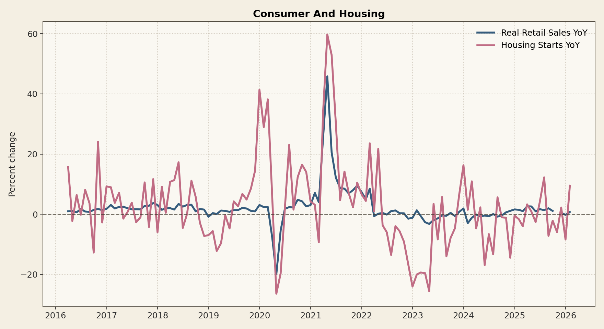

# U.S. Economy Walkthrough

This document pulls together the current macro outputs from the project and explains what each one is saying about the U.S. economy right now.

## Big Picture

The cleanest summary is that the U.S. economy still looks expansionary, but with less momentum and less room for error than earlier in the cycle. Growth has slowed, labor is cooler, inflation is much lower than its peak but not fully settled, and monetary policy still leans restrictive enough to keep pressure on rate-sensitive sectors.

## Current Snapshot

- Real GDP: 2.03% year over year in Q4 2025
- Latest GDP pace: 0.65% annualized quarter over quarter in Q4 2025
- Unemployment rate: 4.4% in February 2026
- Payroll growth: about 5,667 jobs per month on a 3-month average through February 2026
- CPI inflation: 2.43% year over year in February 2026
- Core PCE inflation: 3.06% year over year in January 2026
- Fed funds rate: 3.64% in February 2026
- 10Y-2Y Treasury spread: 0.46 percentage points on March 26, 2026
- Industrial production: 1.44% year over year in February 2026
- Real retail sales: 0.75% year over year in January 2026
- Housing starts: 9.50% year over year in January 2026

## Growth And Activity

This chart compares real GDP growth with industrial production growth. GDP is broad and tends to smooth over sector-level weakness. Industrial production is narrower and more cyclical, so it is often a better gauge of whether the goods side of the economy is accelerating or fading.

### Commentary

Real GDP is still positive on a year-over-year basis, but the latest quarter slowed to a 0.65% annualized pace. Industrial production is also positive, but only modestly so. That combination usually points to an economy that is still growing, but not one with broad cyclical strength.

The nuance here is important: GDP can stay positive even while manufacturing and goods demand cool materially. That is often what a late-cycle economy looks like when services and consumption are holding up better than the industrial side.

## Labor Market

This chart puts the unemployment rate next to the three-month average of payroll changes. The unemployment rate captures labor-market slack. Payroll growth captures hiring momentum. Looking at both at once helps separate a simple cooldown from a genuine labor-market break.

### Commentary

The unemployment rate at 4.4% is still low by historical standards, but it has moved above its recent floor. Payroll growth has slowed sharply, with the three-month average running at about 5,667 jobs per month through February 2026.

That does not yet look like a classic recessionary collapse in hiring, but it does look like a labor market that is losing altitude. A softer hiring trend often shows up before a much more obvious rise in unemployment, which is why this chart matters.

## Inflation

This chart shows both year-over-year and three-month annualized inflation for CPI and core PCE. The year-over-year rate tells us where inflation has been over the last year. The three-month annualized rate tells us whether the most recent few months are running hotter or cooler than that broader trend.

### Commentary

CPI inflation is 2.43% year over year, and core PCE inflation is 3.06% year over year. Those are much better than the peak inflation readings from the earlier post-pandemic period. But the shorter-run measures are firmer: CPI three-month annualized inflation is 2.98% and core PCE three-month annualized inflation is 3.66%.

That is a useful warning sign against declaring victory too early. Inflation has clearly improved, but the latest few months have been a bit warmer than the full 12-month trend. The most accurate reading is not "inflation solved." It is closer to "inflation is down a lot, but the last mile remains uneven."

## Rates And The Curve

This chart combines the fed funds rate, the 10Y-2Y Treasury spread, and a simple real policy rate proxy. Together they show both the current stance of monetary policy and the market's expectations about future growth and rates.

### Commentary

The fed funds rate is 3.64%, the 10Y-2Y spread is positive again at 0.46 percentage points, and the rough real policy rate is about 0.58%. That implies policy is still leaning against demand, but not with the same force that existed when inflation was much higher and the yield curve was deeply inverted.

This is one of the more nuanced areas of the current macro picture. A positive curve no longer carries the same recession warning as a deep inversion, but it also does not automatically mean the economy is re-accelerating. In context, it fits a story where markets expect some easing ahead, while the economy remains slower and more rate-sensitive than usual.

## Consumer And Housing

This chart compares real retail sales growth with housing starts growth. Real retail sales matter because they strip out inflation and show whether households are still increasing spending in volume terms. Housing starts matter because housing is one of the most interest-rate-sensitive parts of the economy.

### Commentary

Real retail sales are up 0.75% year over year, while housing starts are up 9.50% year over year. That tells a mixed story. Consumers are still spending in real terms, which helps keep the broader economy expanding. At the same time, housing remains volatile and rate-sensitive, which is consistent with a restrictive policy backdrop.

This is why weak or choppy housing data should not automatically be read as a recession call if consumer spending is still positive. The more careful interpretation is that households are still carrying the expansion, but not with overwhelming force.

## Final Read

The most defensible interpretation of the current U.S. economy is that it is cooling, not collapsing.

- Growth is still positive, but current momentum is much slower than the rear-view-mirror year-over-year numbers suggest.
- Labor is softer, but not yet clearly recessionary.
- Inflation has improved materially, though recent short-run readings still argue for caution.
- Monetary policy still looks somewhat restrictive, especially for housing and other cyclical sectors.
- Consumer activity remains positive enough to keep the expansion going, even if it no longer looks especially strong.

Taken together, these outputs point to a late-cycle economy with mixed signals rather than a clean boom or an obvious downturn.
